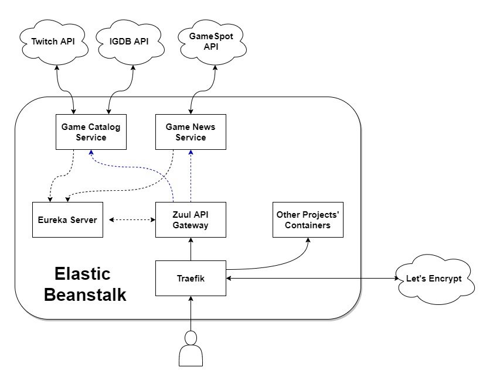

# GameWatch

## Live Link

- Frontend - <https://gamewatch.jctiru.com>
- Backend - <https://api.gamewatch.jctiru.com>

## Overview

A game information and news source website. Java microservices using Spring Boot and Spring Cloud for backend and React SPA for frontend. Microservices environment is simulated as multiple containers inside a single EC2 instance.

Backend hosted on AWS Elastic Beanstalk with multi-docker config. Frontend assets on AWS S3. S3 bucket is behind AWS CloudFront CDN and is not directly accessible except only through AWS CloudFront by using Origin Access Identity. AWS Cloudfront SSL/TLS certificate for custom domain is provided by AWS ACM. Domain registration and DNS service handled by AWS Route53.

Frontend repo goes through TravisCI pipeline which builds the assets and uploads to S3 bucket. Backend repos also goes through TravisCI pipeline which builds and uploads the docker images to Docker Hub, then triggers a central GitlabCI pipeline which handles deployment to Elastic Beanstalk for all projects (includes other projects which are also hosted in the same single EC2 instance). Traefik is used as reverse proxy for multiple containers and to automate Let's Encrypt SSL/TLS certificate generation/management.

## Project Flow Diagram

## Inside Elastic Beanstalk

## Backend Microservices

- Discovery Server - <https://github.com/jctiru/gamewatch-discovery-server>
- API Gateway - <https://github.com/jctiru/gamewatch-api-gateway>
- Game Catalog Service - <https://github.com/jctiru/gamewatch-game-catalog-service>
- Game News Service - <https://github.com/jctiru/gamewatch-game-news-service>

## Features

- View popular games right now, recently released games, coming soon games and most anticipated games
- View game information like release date, publisher, platforms, videos, screenshots, artworks, similar games, etc.
- View latest gaming news

## Overall Project Tech Stack

### Frontend

- [React](https://reactjs.org/) - JS library for building user interfaces
- [React Router](https://reacttraining.com/react-router/) - Routing for react
- [Redux](https://redux.js.org/) - JS library for managing application state
- [Redux-Saga](https://redux-saga.js.org/) - Redux middleware for handling side effects
- [Bootstrap](https://getbootstrap.com/) - CSS framework
- [Bootswatch](https://bootswatch.com/) - Bootstrap themes
- [Axios](https://github.com/axios/axios) Promise based HTTP client

### Backend

- [Spring Boot](https://spring.io/projects/spring-boot) - Preconfigured spring framework
- [Eureka](https://github.com/spring-cloud/spring-cloud-netflix) - Client-side service discovery
- [Zuul](https://github.com/spring-cloud/spring-cloud-netflix) - API Gateway
- [Feign](https://github.com/OpenFeign/feign) - Java to HTTP client binder
- [IGDB API](https://github.com/OpenFeign/feign) - Gaming database site recently acquired by Twitch

### AWS

- [AWS Elastic Beanstalk](https://aws.amazon.com/elasticbeanstalk/) - PaaS for hosting webapp
- [AWS S3](https://aws.amazon.com/s3/) - File storage for static front-end assets
- [AWS Cloudfront](https://aws.amazon.com/cloudfront/) - CDN for S3
- [AWS Route53](https://aws.amazon.com/route53/) - Domain registrar and DNS service
- [AWS ACM](https://aws.amazon.com/certificate-manager/) - SSL/TLS certificates for cloudfront with custom domain
- [AWS IAM](https://aws.amazon.com/iam/) - Manage permissions to allow and deny access to AWS resources

### Misc/Others

- [OpenJ9](https://www.eclipse.org/openj9/) - JVM for OpenJDK for low memory footprint, used for building docker images of backend
- [Docker](https://www.docker.com/) - Containerization
- [TravisCI](https://travis-ci.com/) - CI/CD for building the frontend assets and deploying to S3; CI/CD for building docker images of backend and pushing to dockerhub
- [GitlabCI](https://about.gitlab.com/stages-devops-lifecycle/continuous-integration/) - CI/CD for aggregating projects for deployment to AWS
- [git-secret](https://git-secret.io/) - Encrypt git files at rest and decrypt during CI/CD on Gitlab private repo that deploys to AWS
- [Traefik](https://containo.us/traefik/) - Reverse proxy and automatic SSL/TLS management
- [Let's Encrypt](https://letsencrypt.org/) - SSL/TLS certificate

## Overall Project To-Do List

### General

- Code refactoring
- Code cleanup
- Add tests
- Etc...

### Frontend Specific

- Improve design a bit
- Change carousels arrows design
- Change release date presentation for no-fixed release dates
- Add lightbox for media carousel in game page
- Add captions for media carousel in game page
- Add captions for recommended games carousel in game page
- Etc...

### Backend Specific

- Add game search microservice
- Add game reviews microsevice
- Rewrite fetching of [IGDB API from v3 to v4](https://api-docs.igdb.com/#upgrading-to-v4-from-v3)
- Change news source to [GameSpot API](https://www.gamespot.com/api/documentation#toc-0-4) because of [IGDB API breaking changes](https://api-docs.igdb.com/#breaking-changes)
- Change most popular and most anticipated games query logic because of [IGDB API breaking changes](https://api-docs.igdb.com/#breaking-changes)
- Add retryer on feignclient of IGDB API calls due to [new rate limits](https://api-docs.igdb.com/#rate-limits)
- Add redis to cache results due to [new rate limits](https://api-docs.igdb.com/#rate-limits)
- Add feign error decoder
- Add hystrix circuit breaker
- Add config server
- Add zipkin and sleuth
- Add filebeat that sends to external ELK Stack
- Add swagger documentation
- Improve error messages
- Add simple response on http get on root url
- Etc...
